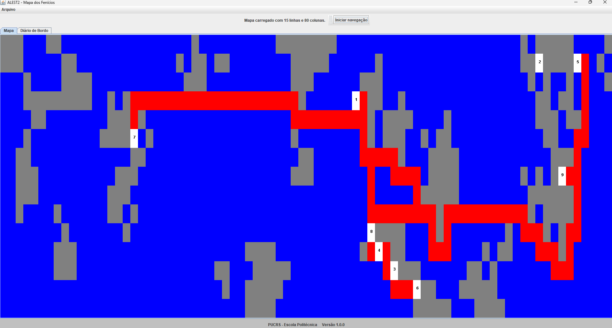
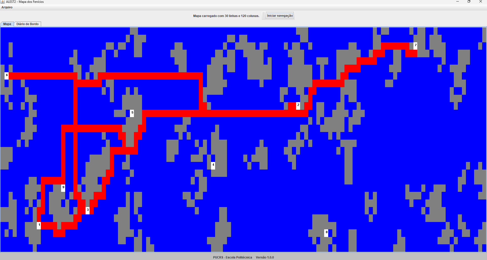
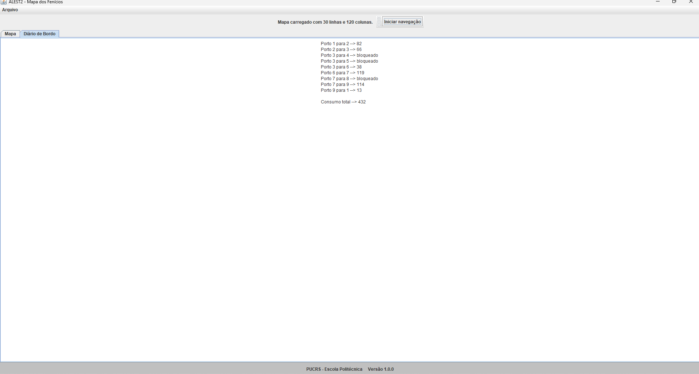
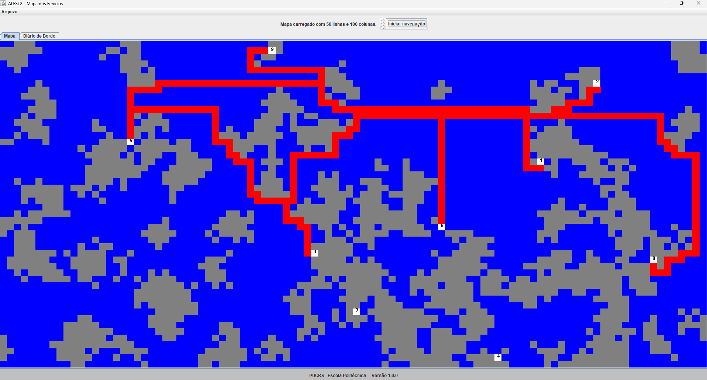
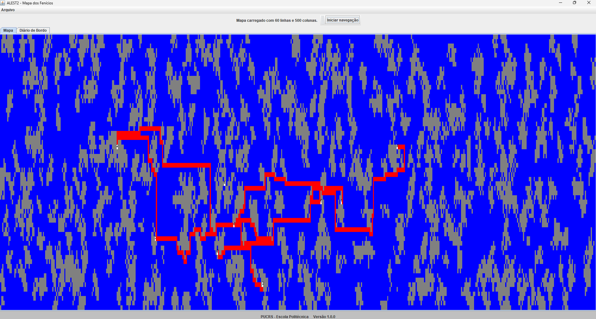
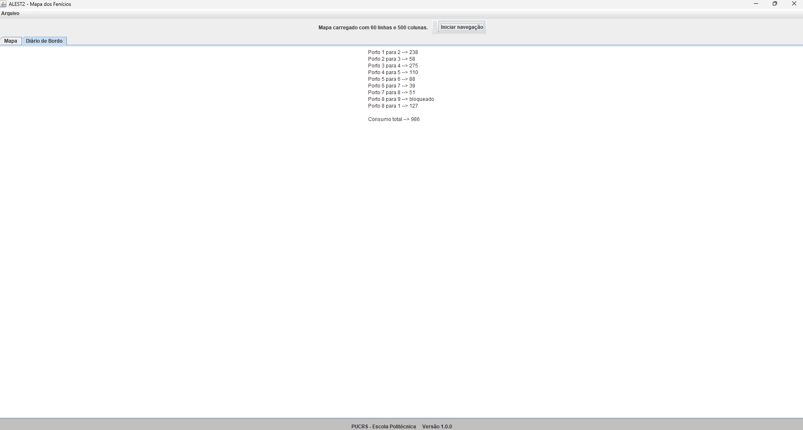
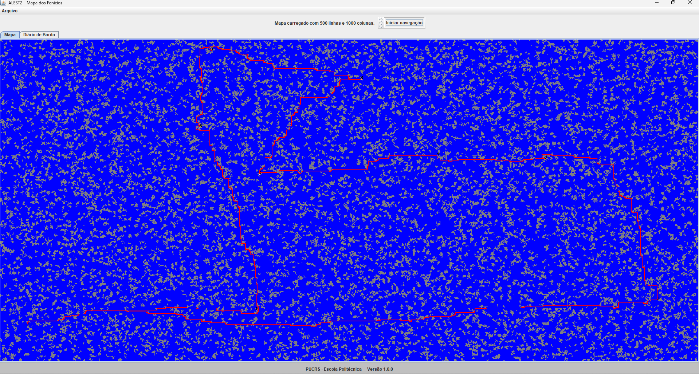
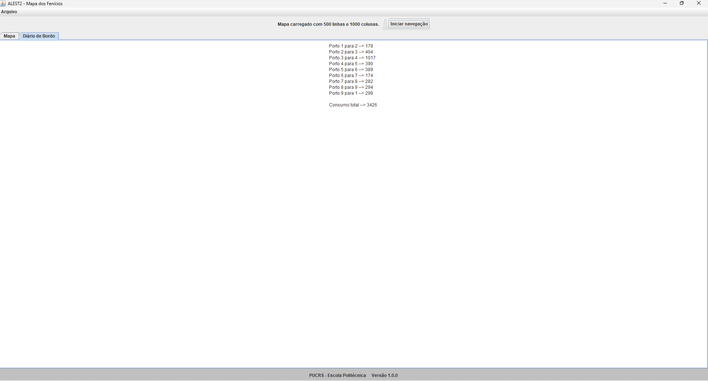

# ALEST2 - Mapa dos Fenícios
## Arquivos e resultados para casos de testes

### Arquivo 1 - mapa_15_80.txt
[mapa_15_80.txt](arquivos%2Fmapa_15_80.txt)

15 linhas x 80 colunas

Custo total = 304

### Arquivo 2 - mapa_30_80.txt
[mapa_30_80.txt](arquivos%2Fmapa_30_80.txt)

30 linhas x 80 colunas

Custo total = 432

### Arquivo 3 - mapa 50_100.txt
[mapa_50_100.txt](arquivos%2Fmapa_50_100.txt)

50 linhas x 100 colunas

Custo total = 484

### Arquivo 4 - mapa 60_500.txt
[mapa_60_500.txt](arquivos%2Fmapa_60_500.txt)

60 linhas x 500 colunas

Custo total = 986

### Arquivo 5 - mapa 500_1000.txt
[mapa_500_1000.txt](arquivos%2Fmapa_500_1000.txt)

500 linhas x 1000 colunas

Custo total = 3426

